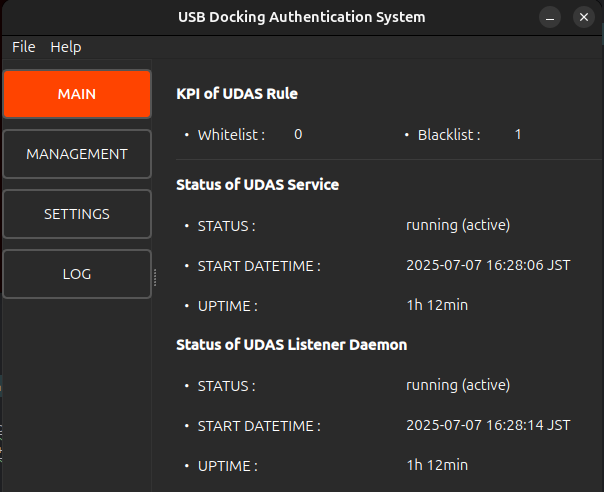
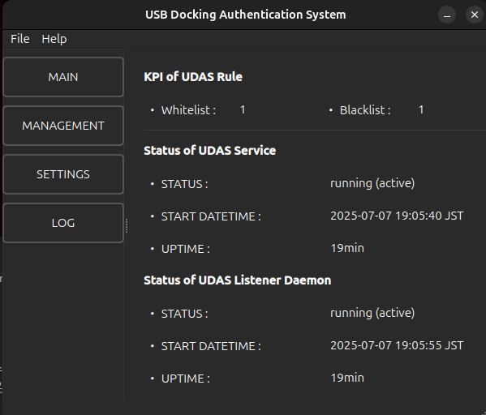
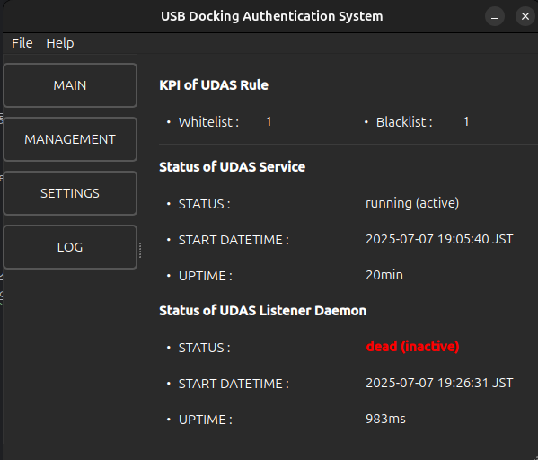
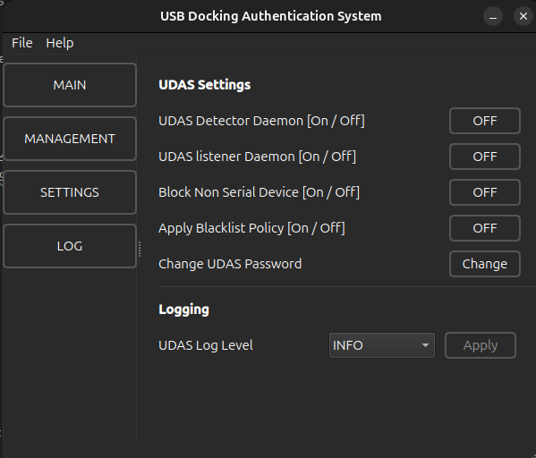

### 翻訳: [英語](README.md) | [日本語](README.ja.md) |　[韓国語](README.ko.md)
<hr>

# USB連結認証システム (UDAS)

## 1. はじめに
<div>
UDAS - USBドッキング認証システムは、ノートパソコン、デスクトップなどUSBポートブロッカーを使用しない個人PCに対し、 
疑わしいUSBストレージデバイスの自動連結によるデータ漏洩や改ざんを防止するために開発されたプログラムです。 
</div><br>

<div>
[ 提供機能 ]<br>
- USBストレージデバイスの接続検出<br> 
- 接続されたデバイスに対するユーザー確認<br>
- デバイスに対するブラックリスト＆ホワイトリスト登録<br>
</div>

## 2. 利用可能なOSおよび環境
<table>
    <th>
        <td>UDASのバージョン</td>
        <td>オペレーティングシステム</td>
        <td>ディストリビューション</td>
    </th>
    <tr>
        <td>1</td>
        <td>0.0.0 (Beta)</td>
        <td>Ubuntu 24.04</td>
        <td>Debian Package</td>
    </tr>
</table>

## 3. インストール
### (1) 手動インストール
① Git Reponsitory ダウンロード

```commandline
git clone --branch main https://github.com/luna-negra/UDAS/
```
<br>
② Python 仮想環境、 Debianパッケージファイルシステムの生成

```commandline
cd UDAS;
python -m venv .venv
bash ./create_pkg.sh
```


* Debian パッケージ生成中にエラーが発生した場合は、画面のガイドに従って対応してください。
<br>

③ Debianパッケージ生成

```commandline
dpkg-deb --build udas-0.0-0-amd64/
```
<br>
④ UDAS Debian パッケージのインストール

```commandline
sudo dpkg -i udas-0.0.0-amd64.deb
```
* 本パッケージファイルは、一般ユーザーアカウントで sudo を使用してインストールすることを推奨します。<br>
* インストール中に画面のガイドに従ってパスワード変更作業およびインストール後のコマンド入力作業を進めてください。<br>

⑤ インストールの確認
* インストールを実行したアカウントのホームフォルダから UDAS/udas_gui を実行します。

```commandline
~/udas/udas_gui
```


* GUI画面で「Main > サービス稼働状況」を確認します。


* UDAS Detector および UDAS Listener サービスが稼働中の場合、PCにUSBストレージデバイスを接続すると、ホワイトリスト登録の確認メッセージウィンドウが表示されます。


### 4. 使用方法
<div>
UDASの設定、USBデバイス管理、サービス起動、ログ確認などは、GUIプログラムを通じて行うことができます。 
GUIプログラムは以下の4つのセクションに分かれています。<br>

- Main
- Management
- Settings
- Logging<br>

</div>

#### (1) Main
Main セクションは、現在ブラックリストまたはホワイトリストに登録されているUSBストレージデバイスの数と、UDAS関連サービスデーモンの状態を表示します。


* UDAS関連サービスデーモンにはDetectorとListenerがあり、どちらか一方でも動作していない場合、USBストレージデバイスのリアルタイム検出はできません


#### (2) Management
Management セクションは、ブラックリストまたはホワイトリストに登録されているUSBストレージデバイスのリスト表示と削除機能を提供します。


#### (3) Settings
Settings セクションは、UDASサービスの起動管理およびその他の設定管理機能を提供します。


* UDAS Detector Daemon: Detectingサービスの起動/停止時に使用します。（sudo権限が必要）
* UDAS Listener Daemon: Listenerサービスの起動/停止時に使用します。
* Block Non Serial Device: シリアル番号が存在しないUSBストレージデバイスを即座にブロックする機能を有効/無効にする場合に使用します。（sudo権限が必要）
* Apply Blacklist Policy: 新規USBストレージデバイス検出後、ホワイトリストに未登録の場合にブラックリストデバイスとして登録する機能を有効/無効にする場合に使用します。（sudo権限が必要）
* Change UDAS Password: UDAS管理パスワードを変更します。（sudo権限が必要）
* UDAS Log level: ログレベルを変更します。（sudo権限が必要）

#### (4) Logging
UDASのログ記録を表示します。主要なログレベルで結果をフィルタリングして確認できます。

<br>

### 5. アンインストール
```commandline
sudo dpkg -r udas
```
* 削除後、画面に表示されるガイドに従って後続作業を進めてください。