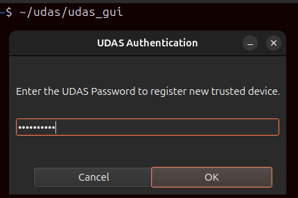

### 번역: [영어](README.md) | [일본어](README.ja.md) |　[한국어](README.ko.md)
<hr>

# USB 접속 인증 시스템 (UDAS)

## 1. 소개
<div>
UDAS - USB Docking Authentication System은 Labtop, Desktop 등 USB 포트 블로커를 사용하지 않는 개인 PC에 대해, 
의심스러운 USB 저장 장치의 자동 연결로 인한 데이터 유출 혹은 변조를 방지하기 위해 개발된 프로그램입니다.
</div><br>

<div>
[ 제공 기능 ]<br>
- USB 저장 장치의 연결 감지<br> 
- 연결된 장치에 대한 사용자 확인<br>
- 장체에 대한 Blacklist & Whitelist 등록<br>
</div>

## 2. 사용 가능 OS 및 환경
<table>
    <th>
        <td>UDAS 버전</td>
        <td>운영 체제</td>
        <td>배포 형식</td>
    </th>
    <tr>
        <td>1</td>
        <td>0.0.0 (Beta)</td>
        <td>Ubuntu 24.04</td>
        <td>Debian Package</td>
    </tr>
</table>

## 3. 설치
### (1) 수동 설치
① Git Reponsitory 다운로드

```commandline
git clone --branch main https://github.com/luna-negra/UDAS/
```
<br>
② Python 가상 환경 및 Debian 패키지 파일 시스템 생성

```commandline
cd UDAS;
python -m venv .venv
bash ./create_pkg.sh
```


* Debian 패키지 생성 중 에러 발생 시, 화면의 가이드에 따라 조치해 주십시오.
<br>

③ Debian 패키지 생성

```commandline
dpkg-deb --build udas-0.0-0-amd64/
```
<br>
④ UDAS Debian 패키지 설치

```commandline
sudo dpkg -i udas-0.0.0-amd64.deb
```
* 본 패키지 파일은 일반 사용자 계정으로 sudo를 사용하여 설치하는 것을 권장합니다.<br>
* 설치 중 화면의 가이드에 따라 비밀번호 변경 작업 및 설치 후 명령어 입력 작업을 진행해 주십시오.<br>

⑤ 설치 확인
* 설치를 진행한 계정의 홈 폴더에서 UDAS/udas_gui 실행.

```commandline
~/udas/udas_gui
```



* GUI 화면에서 Main > 서비스 구동 여부 확인<br>


* UDAS Detector 및 UDAS Listener 서비스가 구동 중인 경우, PC에 USB 저장 장치 연결 시 whitelist 등록 여부를 확인하는 메세지 창이 생성됩니다.<br>


### 4. 사용
<div>
UDAS의 설정, USB 장치 관리, 서비스 기동, 로그 확인 등은 GUI 프로그램을 통해 진행할 수 있습니다.
GUI 프로그램은 아래의 네 가지 섹션으로 구분됩니다.<br>

- Main
- Management
- Settings
- Logging<br>

</div>

#### (1) Main
Main 섹션은 현재 Blacklist 또는 Whitelist로 등록된 USB 저장 장치의 수량 및, UDAS 관련 서비스 데몬의 상태를 표시합니다.


* UDAS 관련 서비스 데몬은 Detector와 Listener가 존재하며, 두 서비스 중 하나라도 동작하지 않으면 실시간으로 USB 저장 장치 감지가 불가능합니다.


#### (2) Management
Management 섹션은 Blacklist 또는 Whitelist로 등록된 USB 저장 장치의 목록 표시 및 삭제 기능을 제공합니다.


#### (3) Settings
Settings 섹션은 UDAS 서비스 기동 관리 및 기타 설정 관리 기능을 제공합니다.


* UDAS Detector Daemon: Detecting 서비스의 기동 / 정지 시 사용합니다. (sudo 권한 필요)
* UDAS Listener Daemon: Listener 서비스의 기동 / 정지 시 사용합니다. 
* Block Non Serial Device: Serial 번호가 존재하지 않는 USB 저장 장치를 즉시 차단하는 기능을 활성 / 비활성화 하는 경우 사용합니다. (sudo 권한 필요)
* Apply Blacklist Policy: 신규 USB 저장 장치 감지 후 Whitelist 미등록 시, Blacklist 장치로 등록하는 기능을 활성 / 비활성화 하는 경우 사용합니다. (sudo 권한 필요)
* Change UDAS Passsword: UDAS 관리 패스워드를 변경합니다. (sudo 권한 필요)
* UDAS Log level: 로그 레벨을 변경합니다. (sudo 권한 필요)

#### (4) Logging
UDAS 로그 기록을 표시합니다. 주요 로그 레벨을 필터링하여 결과를 확인할 수 있습니다.

<br>

### 5. 삭제
```commandline
sudo dpkg -r udas
```
* 삭제 후 화면에 나타나는 가이드에 따라 후속 작업을 진행해 주십시오.